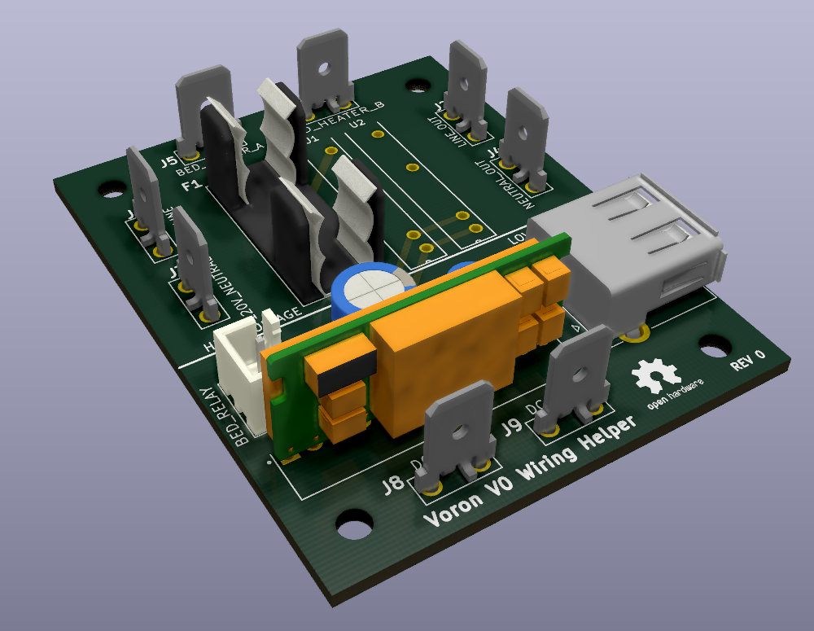

# VORON V0 Wiring Helper PCB

A PCB to simplify the mains wiring for a Voron V0.

**DISCLAIMER: Use at your own risk!**
This device is attached directly to 120V mains power. The electricity running through this device
can start fires, shock, injure, or even kill you. Please be careful!

I provide no warranty or guarantee as to the safety of this device. Use at your own risk.

## Motivation
The Voron V0 kit I purchased contained cheap electronics. The 120V mains relay for the heated bed
was unsafe. Instead of buying off-the-shelf electronics, I decided to build a PCB to simplify
the wiring. Cost is approximately the same as quality off-the-shelf components.

This device is responsible for:
 - Heated bed fusing.
 - 120VAC power split to the 24V PSU and heated bed.
 - Providing 5VDC USB power for the Raspberry Pi.

## Design
This PCB was designed in KiCad, free and open-source EDA software.

### PCB Fabrication
You should be able to order this board from any 2-layer PCB supplier.

Download the `GERBER` files, and upload them to you PCB supplier of choice.

Select the thickest copper plating available, the high-voltage traces carry ~1.25A @ 120VAC.

**Recommended PCB Fabricators:**
 - https://jlcpcb.com/ (Lowest Cost)
 - https://oshpark.com/ (Fast, Mid-Cost)
 - https://www.4pcb.com/ (Based in USA)

### BOM
Digikey part numbers are provided here, and in the schematic. All parts are commonly available,
and you should be able to order from any vendor (Mouser, Digikey, etc).

**Required electronic parts:**

| Ref   | Qty | Description        | Digikey P/N           |
|-------|-----|--------------------|-----------------------|
| F1    |  1  | Fuse Holder        | 732-11375-ND          |
| F1    |  1  | 120VAC 1.5A Fuse   | 507-1545-ND           |
| J1-6  |  8  | PCB Spade Terminal | A29938CT-ND           |
| J8 J9 |     |                    |                       |
| J7    |  1  | JST 2-Pin Conn     | 455-2273-ND           |
| J10   |  1  | USB A Female Conn  | SAM10369-ND           |
| U1,U2 |  2  | 24V SSR            | PB1706-ND             |
| PS1   |  1  | 24V to 5V DC/DC    | 102-P783F-Q24-S5-S-ND |
| C1    |  1  | 50V 100uF          | 1189-1860-ND          |
| C2    |  1  | 25V 22uF           | 1189-3984-ND          |

[Order this BOM on Digikey](https://www.digikey.com/BOM/Create/CreateSharedBom?bomId=8479123)

The cost is ~$27 (USD) at the time of writing.

### Additional Notes
Recommended CUI PCB Footprint:
https://www.cui.com/product/resource/pcbfootprint/p783f-q24-s5-s
